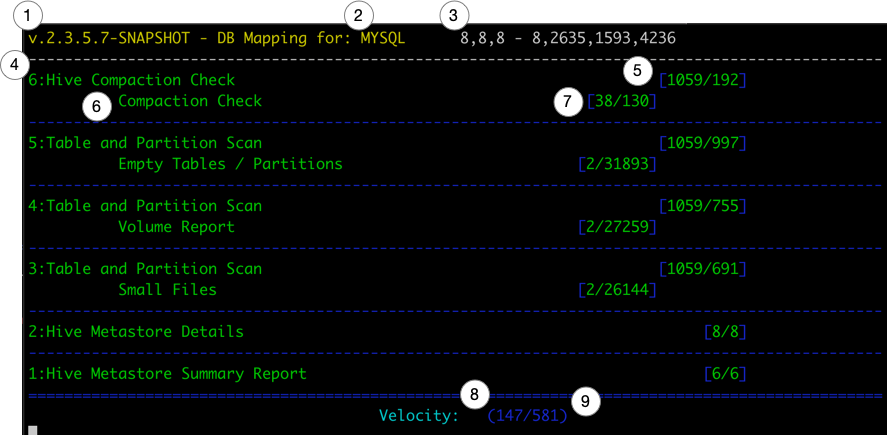

# Running

To ease the launch of the application below, configure these core environment variables.

```
hive-sre u3|sre  
```
## u3 Specifics
`hive-sre u3 -all|-cdh|-hdp2|-hdp3 <options>`


**NOTE** It is NOT necessary to use the `-cfg` option if you're config is `$HOME/.hive-sre/cfg/default`.


## UI Details for `sre` and `u3`

Only active processes will show up in the UI.  The UI will refresh every second and display the current details below.

There are several 'processes' that are defined in `u3`.  Each process will run 1 or more 'sub-processes'.  The counters lists in the UI are specific to the 'process' and 'sub-processes' in that section.

The number of concurrent processes is controlled by the `parallelism` variable in the configuration yaml defined above.

1. `hive-sre` version information
2. Metastore RDBMS Type
3. Thread Status `a,b,c - d,e,f,j`
    - (a) Core Pool Size
    - (b) Largest Pool Size
    - (c) Max Pool Size
    - (d) Active Thread Count
    - (e) Completed Thread Tasks
    - (f) Remaining Thread Queue
    - (j) Total Task Count
4. Procedure Name
5. Procedure Counts `[Total/Completed]`
    - `Total` is the full count of all tasks for that process
    - `Completed` is the number of tasks this procedure has completed.
6. Procedure Check - Child of Procedure
7. Procedure Check Counts - `errors/successes`
8. Velocity - Total Time in Seconds process has been running.
9. Velocity - The average number of Tasks completed per second since job started.
    - Note that not all Tasks are equal.  Task times vary based on the content of the cluster and area being inspected.  And can largely be effected by Namenode performance.


